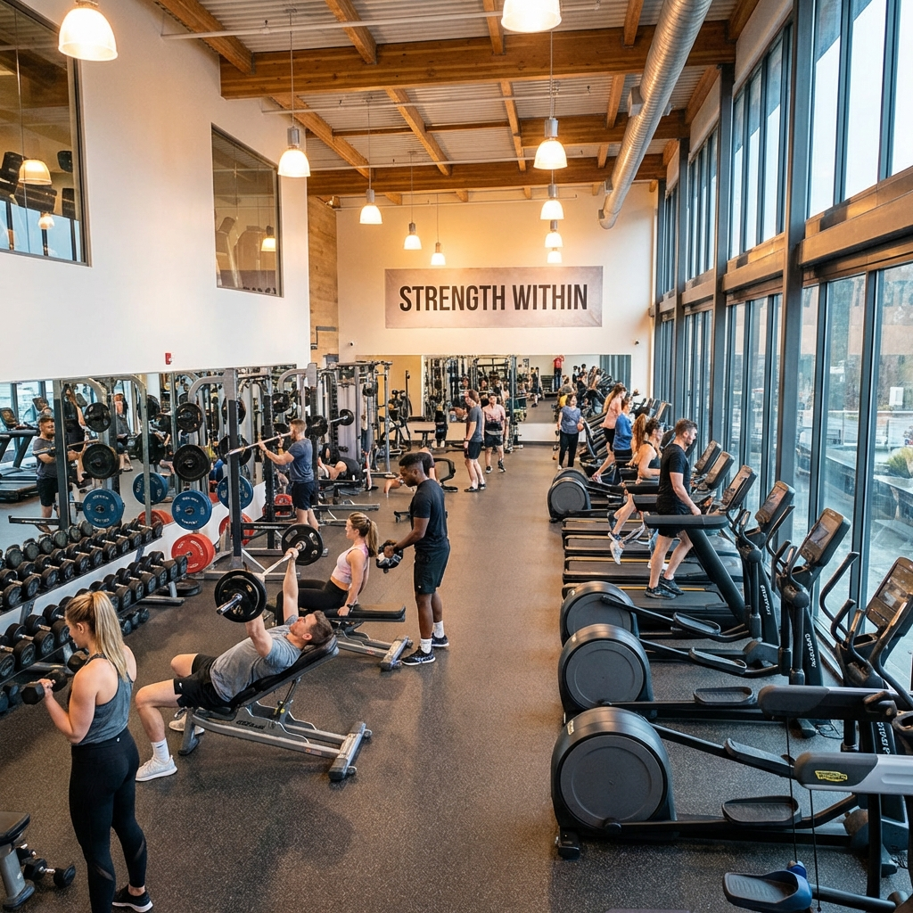

# 🎥 Video Background Implementation Guide

## Option 1: Hero Section Video Background (Recommended)

### Step 1: Add Video File
1. Download a gym workout video (free sources):
   - **Pexels**: https://www.pexels.com/search/videos/gym/
   - **Pixabay**: https://pixabay.com/videos/search/gym/
   - **Coverr**: https://coverr.co/

2. Save video as: `assets/videos/gym-hero.mp4`

### Step 2: Update `index.html` Hero Section

Replace lines 79-82 with this code:

```html
<!-- Hero Section with Video Background -->
<section class="relative h-screen flex items-center justify-center text-white" style="margin-top: 0;">
    <!-- Video Background -->
    <video autoplay muted loop playsinline class="absolute inset-0 w-full h-full object-cover">
        <source src="assets/videos/gym-hero.mp4" type="video/mp4">
        <!-- Fallback to image if video doesn't load -->
        
    </video>
    
    <!-- Dark Overlay -->
    <div class="absolute inset-0 bg-black opacity-60 z-10"></div>
    
    <!-- Content -->
    <div class="relative z-20 text-center px-4">
        <h1 class="text-5xl md:text-7xl font-heading font-bold mb-4">
            TRANSFORM YOUR <span class="text-fitness-orange">BODY</span>
        </h1>
        <p class="text-xl md:text-2xl mb-8 font-light">
            Join FitForge Gym - Where Strength Meets Dedication
        </p>
        <a href="https://wa.me/919876543210?text=Hi,%20I%20want%20to%20join%20FitForge%20Gym" 
           target="_blank"
           class="inline-block bg-fitness-orange hover:bg-orange-600 text-white font-bold py-4 px-8 rounded-lg text-lg transition transform hover:scale-105">
            JOIN NOW
        </a>
    </div>
</section>
```

### Key Features:
- ✅ **autoplay**: Video automatically plays
- ✅ **muted**: No sound (required for autoplay)
- ✅ **loop**: Video repeats continuously
- ✅ **playsinline**: Works on mobile devices
- ✅ **Fallback**: Shows image if video fails

---

## Option 2: YouTube Video Embed (Gallery/About Page)

### Add to Gallery or About Page:

```html
<!-- YouTube Video Section -->
<section class="py-16 bg-white">
    <div class="container mx-auto px-4">
        <h2 class="text-4xl font-heading font-bold text-center mb-12">
            Watch Our <span class="text-fitness-orange">Gym Tour</span>
        </h2>
        
        <div class="max-w-4xl mx-auto">
            <!-- Responsive YouTube Embed -->
            <div class="relative" style="padding-bottom: 56.25%; height: 0;">
                <iframe 
                    class="absolute top-0 left-0 w-full h-full rounded-lg shadow-lg"
                    src="https://www.youtube.com/embed/YOUR_VIDEO_ID" 
                    title="Gym Tour"
                    frameborder="0" 
                    allow="accelerometer; autoplay; clipboard-write; encrypted-media; gyroscope; picture-in-picture" 
                    allowfullscreen>
                </iframe>
            </div>
        </div>
    </div>
</section>
```

Replace `YOUR_VIDEO_ID` with your YouTube video ID.

---

## Option 3: Testimonial Video Section

```html
<!-- Video Testimonials -->
<section class="py-16 bg-gray-50">
    <div class="container mx-auto px-4">
        <h2 class="text-4xl font-heading font-bold text-center mb-12">
            Member <span class="text-fitness-orange">Success Stories</span>
        </h2>
        
        <div class="grid md:grid-cols-2 gap-8 max-w-6xl mx-auto">
            <!-- Video 1 -->
            <div class="bg-white rounded-lg shadow-lg overflow-hidden">
                <video controls class="w-full">
                    <source src="assets/videos/testimonial-1.mp4" type="video/mp4">
                    Your browser does not support the video tag.
                </video>
                <div class="p-4">
                    <h3 class="font-bold text-lg">Rahul's Transformation</h3>
                    <p class="text-gray-600">Lost 20kg in 6 months</p>
                </div>
            </div>
            
            <!-- Video 2 -->
            <div class="bg-white rounded-lg shadow-lg overflow-hidden">
                <video controls class="w-full">
                    <source src="assets/videos/testimonial-2.mp4" type="video/mp4">
                    Your browser does not support the video tag.
                </video>
                <div class="p-4">
                    <h3 class="font-bold text-lg">Priya's Journey</h3>
                    <p class="text-gray-600">Gained strength & confidence</p>
                </div>
            </div>
        </div>
    </div>
</section>
```

---

## 📱 Mobile Optimization for Videos

### CSS for Better Performance:

Add to `css/style.css`:

```css
/* Video Optimization */
video {
    max-width: 100%;
    height: auto;
}

/* Reduce video quality on mobile to save data */
@media (max-width: 768px) {
    video {
        /* Mobile devices will load lower quality */
        object-fit: cover;
    }
}

/* Pause video on mobile if needed (optional) */
@media (max-width: 768px) {
    .hero-video {
        display: none; /* Hide video on mobile */
    }
    .hero-video-fallback {
        display: block; /* Show image instead */
    }
}
```

---

## ⚡ Performance Tips

### 1. Video File Size
- **Recommended:** 5-10 MB max
- **Format:** MP4 (H.264 codec)
- **Resolution:** 1920x1080 (Full HD)
- **Duration:** 10-30 seconds (looping)

### 2. Compress Video
Use free tools:
- **HandBrake**: https://handbrake.fr/
- **CloudConvert**: https://cloudconvert.com/
- **Online Video Compressor**: https://www.freeconvert.com/video-compressor

### 3. Lazy Loading (Advanced)
```html
<video autoplay muted loop playsinline loading="lazy">
    <source src="assets/videos/gym-hero.mp4" type="video/mp4">
</video>
```

---

## 🎬 Free Video Resources

### Gym Workout Videos:
1. **Pexels**: https://www.pexels.com/search/videos/gym%20workout/
2. **Pixabay**: https://pixabay.com/videos/search/fitness/
3. **Coverr**: https://coverr.co/videos/fitness

### Download Tips:
- Choose **1920x1080** resolution
- Download **MP4** format
- Keep duration **10-20 seconds**
- Look for **loopable** videos

---

## 📂 Folder Structure

```
gym/
├── assets/
│   ├── images/
│   └── videos/          # Create this folder
│       ├── gym-hero.mp4
│       ├── testimonial-1.mp4
│       └── testimonial-2.mp4
```

---

## ✅ Implementation Checklist

- [ ] Create `assets/videos/` folder
- [ ] Download gym video from Pexels/Pixabay
- [ ] Compress video to < 10MB
- [ ] Update `index.html` with video code
- [ ] Test on desktop browser
- [ ] Test on mobile device
- [ ] Check loading speed
- [ ] Commit and push to GitHub

---

## 🚀 Quick Start

```bash
# 1. Create videos folder
mkdir assets/videos

# 2. Add your video file to assets/videos/

# 3. Update index.html (use code above)

# 4. Test locally
# Open index.html in browser

# 5. Push to GitHub
git add .
git commit -m "Add video background to hero section"
git push origin main
```

---

## 🎯 Best Practice

**For Budget Website (₹3000 range):**
- ✅ Use **image background** (current) - Fast & reliable
- ✅ Add **YouTube embed** in About/Gallery - No hosting cost
- ❌ Avoid heavy video files - Slow loading on mobile

**For Premium Website:**
- ✅ Use **video background** - Professional look
- ✅ Compress properly - Good performance
- ✅ Add fallback image - Works everywhere

---

**Recommendation:** Keep current image background for now. Add YouTube video in Gallery page for gym tour! 🎥
